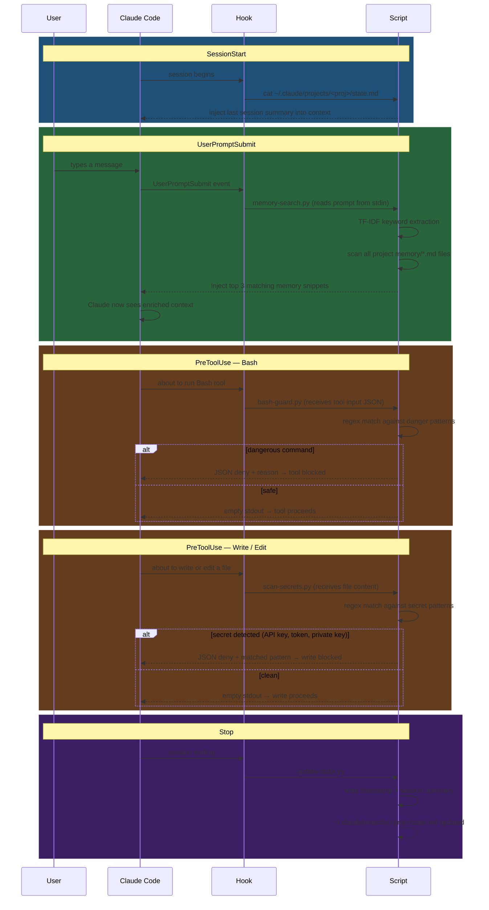
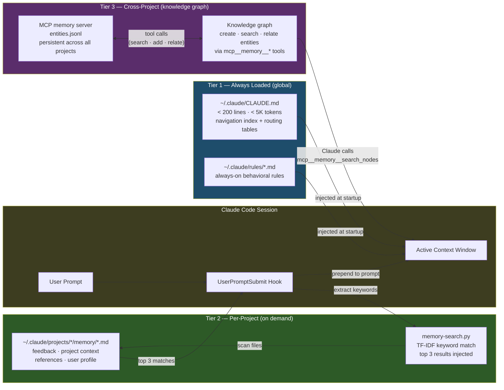

# Claude Setup — Architecture Diagrams

---

## Diagram 1 — Layer Stack

How the 7 layers compose into a unified Claude Code environment.
Each layer builds on the ones below it; Claude Code consumes all of them.

```mermaid
graph TB
    CC(["🤖 Claude Code"])

    subgraph L7["Layer 7 — Skills"]
        direction LR
        KG["karpathy-guidelines\n(Think·Simplicity·Surgical·Goal-Driven)"]
        DR["deep-research\n(5-stage pipeline · IRON RULE · anti-sycophancy)"]
    end

    subgraph L6["Layer 6 — Config & Templates"]
        direction LR
        CM["CLAUDE.md\n(global nav index, <5K tokens)"]
        RO["6 role overlays\n(dev · researcher · designer · PM · devops · data)"]
        TT["3 team templates\n(research · dev · full-pipeline)"]
    end

    subgraph L5["Layer 5 — Memory & Security"]
        direction LR
        MS["memory-search.py\n(UserPromptSubmit · TF-IDF injection)"]
        BG["bash-guard.py\n(PreToolUse · blocks rm -rf · force push)"]
        SS["scan-secrets.py\n(PreToolUse · detects API keys · tokens)"]
        US["update-state.py\n(Stop · writes session summary)"]
        MM["MCP memory server\n(knowledge graph · entities.jsonl)"]
    end

    subgraph L4["Layer 4 — Observability"]
        HUD["HUD status line\nuser:path  branch*  ctx:%  model  time  todos:N"]
    end

    subgraph L3["Layer 3 — Agents"]
        AA["agency-agents  100+ agents\n(engineering · design · marketing\nsales · product · support · academic)"]
    end

    subgraph L2["Layer 2 — Research"]
        L30["last30days-skill\n(Reddit · X · HN · YouTube · TikTok)"]
        DRS["deep-research skill\n(flash / standard / pro / deep modes)"]
    end

    subgraph L1["Layer 1 — Methodology"]
        SP["superpowers  14 skills\n(TDD · verify · Generator≠Evaluator)"]
        MP["mattpocock/skills\n(SKILL.md format · PRD-to-plan · grill-me)"]
        IM["impeccable  21 skills\n(critique → arrange → colorize → polish)"]
    end

    subgraph L0["Layer 0 — ECC Base Infrastructure"]
        direction LR
        SKL["181 skills\n(routing table · auto-select)"]
        AGT["47 agents\n(planner · architect · reviewer · TDD · security)"]
        HKS["20+ hooks\n(session · memory · security · state)"]
        DF["DevFleet\n(multi-agent · tmux · worktrees)"]
        CL["continuous learning\n(auto-generate skills from tasks)"]
        CB["context budget\n(/context-budget · /strategic-compact)"]
    end

    CC --> L7
    L7 --> L6
    L6 --> L5
    L5 --> L4
    L4 --> L3
    L3 --> L2
    L2 --> L1
    L1 --> L0
```

---

## Diagram 2 — Hook Execution Flow

How hooks intercept Claude Code's lifecycle at 5 event points.
Hooks run as shell commands; Claude sees their stdout as injected context or a block decision.

---

## Diagram 3 — 3-Tier Memory System

How context is persisted and retrieved across sessions and projects.

